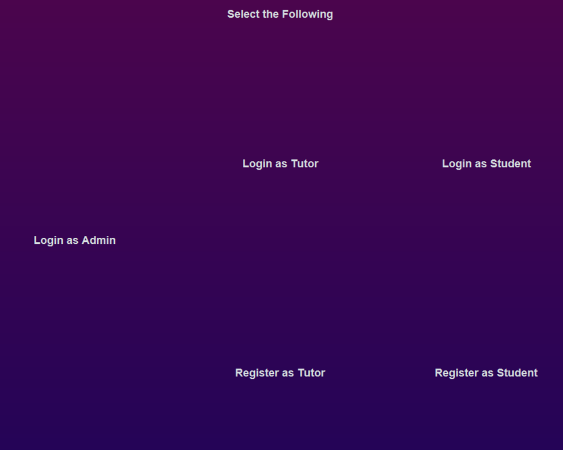
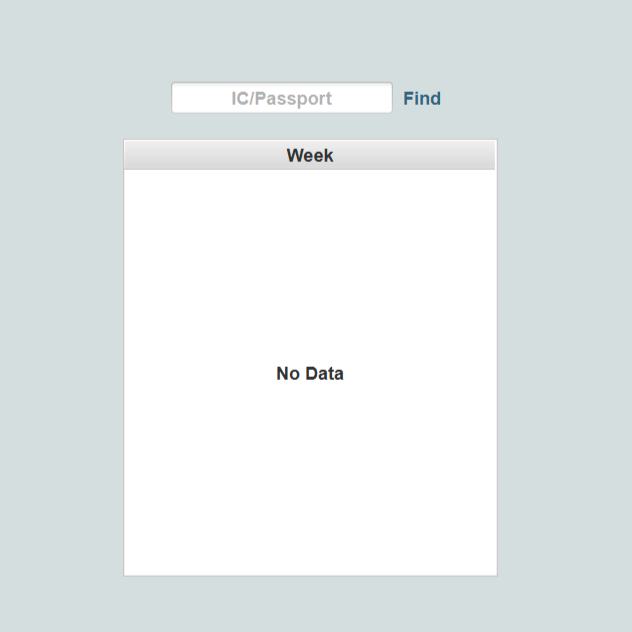
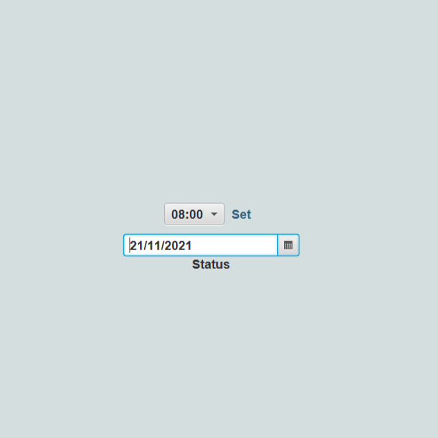
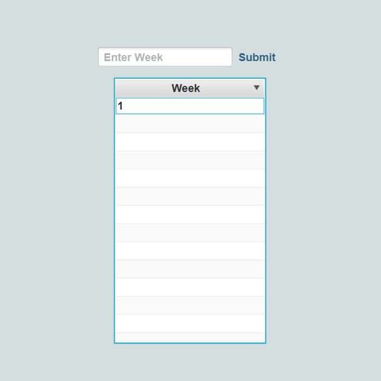

# Driving School System

A simulation system created to student Java with JavaFx. This is a group project where I contribute to the features for Tutor while leading the front-end development.

## Key Features

Here are some key features of the project separated by three parts: Admin, Tutor and Student.

  

### Admin

1. Distribute Training module
2. View and update Tutor profile
3. View and update Student Profile
4. Receive report by Tutors

5. Receive payment by Students

### Tutor

1. Create, login and view Tutor account
2. Set availability date

3. View Tutor schedule
4. View training gistory
5. Send report to admin

### Student

1. Create, login and view Student account

2. View personal schedule
3. Choose training date

4. Make payment (simulation only)
5. View training history

## Development Installation

### Prerequisites

1. Install Java SDK, for example [Oracle](https://www.oracle.com/java/technologies/downloads/).
2. Install [Java Fx](https://openjfx.io/openjfx-docs/).
2. Install an IDE. For example [Visual Studio Code](https://code.visualstudio.com/).

### Open project

Open project using File > Open folder.